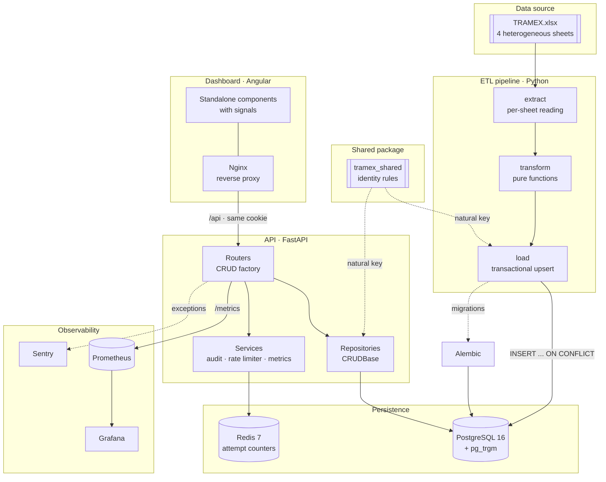
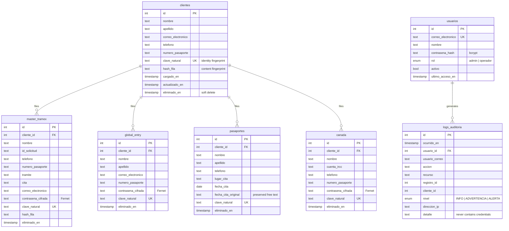
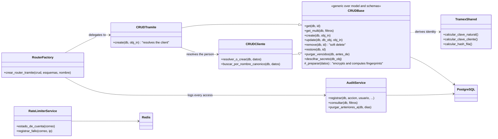
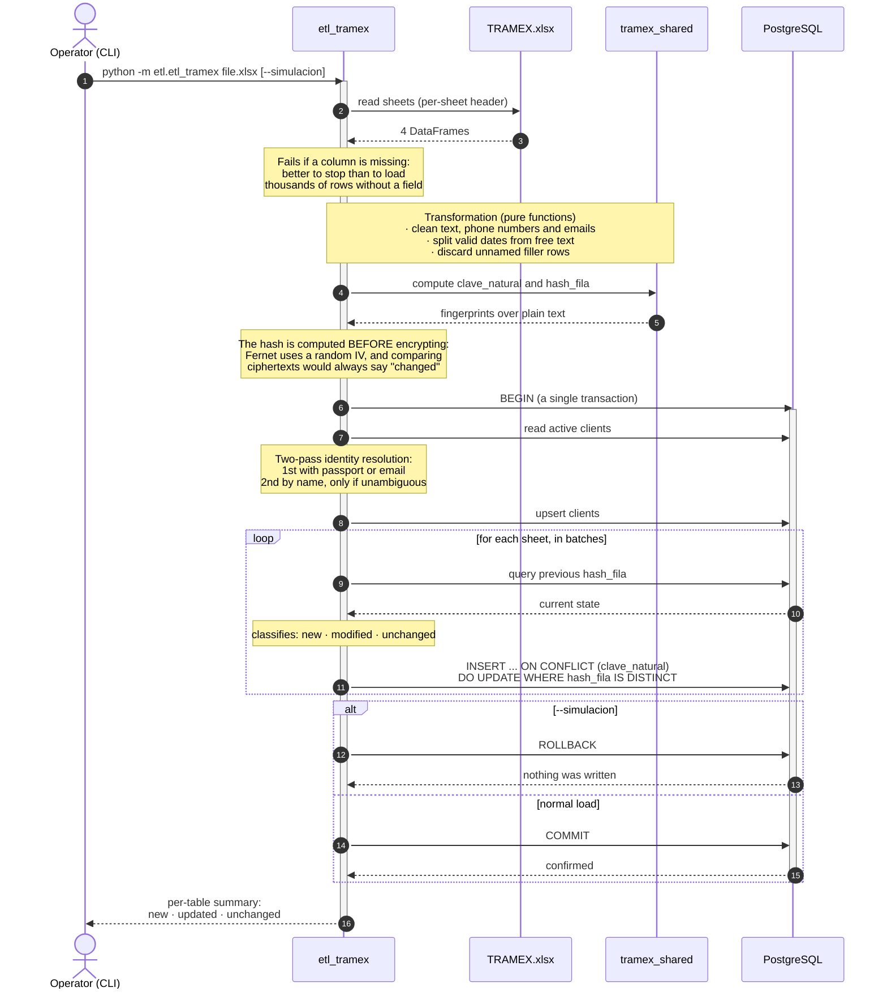

# Tramex · Immigration Tramite Management System

An immigration paperwork agency ran on **a shared spreadsheet**. It held clients'
records and, in plain-text cells right next to their name and passport number,
**the passwords for those people's consular accounts** — because the agency needs
to log into those accounts to manage the tramites on their behalf.

This repository replaces that spreadsheet: an ETL pipeline that ingests it, an API
that replaces it as the system of record, and a dashboard to operate from, with
credentials encrypted and every access to them logged.

---

## Project status

| Indicator | Status |
|---|---|
| **Continuous integration** | [](https://github.com/alexander-tinoco/tramex-etl/actions/workflows/ci.yml) |
| **Continuous delivery** | [](https://github.com/alexander-tinoco/tramex-etl/actions/workflows/cd.yml) |
| **License** | [](https://opensource.org/licenses/MIT) |
| **API documentation** | [](http://localhost:8000/docs) · 44 operations across 27 routes |
| **Tests** | **184** in Python (API + ETL) · **61** in the dashboard |
| **Coverage** | **90.4%**, with a threshold that breaks the build below 85% |
| **Typing** | `mypy` across the API, ETL, and shared package · strict `tsc` with no `any` |
| **Governance** | Conventional Commits (Husky + commitlint) · [ADRs](docs/decisions/) · Dependabot · Gitleaks |

---

## The problem, concretely

What the spreadsheet did, and what the system does instead:

| | Before (shared Excel) | Now |
|---|---|---|
| **Client credentials** | Plain text in a cell | Encrypted with Fernet; only decrypted on explicit request |
| **Who looked up a credential** | Unknown | Logged in `logs_auditoria` with user, date, IP, and record |
| **The same person across sheets** | Four unrelated rows | One client with tramites linked by foreign key |
| **Reloading the file** | Duplicated records | Idempotent: reconciling the same file changes nothing |
| **Dates written by hand** (`"MARZO"`) | Lost during normalization | Preserved as original text alongside the date field |
| **Access control** | Whoever had the link | Users with roles, `httpOnly` cookie session, brute-force lockout |
| **Deleting a record** | Irreversible, no trace | Reversible, audited soft delete; destruction only via retention |

Against the included demo file, the pipeline resolves **315 tramite rows spread
across four sheets into 161 distinct people**, in under a second, and a second run
of the same file reports zero changes.

---

## Architecture



The **shared package** is what prevents this design's most likely silent failure:
the ETL and the API write to the same tables, and if each one derived a row's
identity its own way, a client entered by hand and that same client present in the
Excel file would end up duplicated without anything breaking
([ADR 0006](docs/decisions/0006-paquete-compartido-entre-etl-y-api.md)).

---

## Data model

The Excel file had four flat tabs with no relationship between them. The relational
model revolves around `clientes`: a person can have a passport tramite, a Global
Entry tramite, and a Canada tramite all at once, and now that's a single query
instead of a manual name search across four sheets.



**`clave_natural` is unique only among active records** (partial index). That way a
current record and its archived versions coexist, and the ETL's `ON CONFLICT` can
target that index ([ADR 0004](docs/decisions/0004-borrado-logico-y-retencion.md)).

---

## Security and sensitive data

This is what defines the project: the system holds passwords for third parties'
government accounts.

### Why credentials are encrypted, not hashed

The instinctive reaction to "we need to store passwords" is to hash them with
bcrypt. Here that would be a category error, because hashing and encryption answer
different questions:

|  | Hash (bcrypt) | Encryption (Fernet) |
|---|---|---|
| Answers | "is this the correct password?" | "what was the password?" |
| Used to | **verify** whoever is logging in | **custody** someone else's secret |
| In this system | **operators'** passwords | **client account** credentials |

The agency doesn't need to *verify* the client's password: it needs to *recover*
it to type into the consular portal. A hash would make it useless. That's why both
mechanisms coexist, and it isn't a contradiction
([ADR 0001](docs/decisions/0001-cifrado-reversible-de-credenciales.md)).

Because the data is recoverable, the control can't be cryptographic and has to be
access-based. That drives everything else:

- **Real authentication.** A users table with bcrypt hashing, not a pair of
  environment variables shared by the whole team. One user per person is what
  makes "who looked up that credential?" answerable.
- **`httpOnly` cookie session.** Invisible to JavaScript: an XSS alone is no longer
  enough to steal the session. `Authorization: Bearer` is also accepted for
  Swagger and scripts.
- **Two roles.** `operador` handles tramites and looks up credentials; `admin`
  additionally manages users, reads the audit log, and runs retention.
- **Audit log.** Every decryption is logged with user, date, IP, and record. The
  endpoint's response returns the entry number, and the interface shows it:
  whoever looks something up sees that it was logged. **What was looked up is
  logged, never what was obtained.**
- **Brute force.** Account lockout (resists IP rotation) plus a per-origin limit,
  with counters in Redis so multiple replicas share state.
- **Constant-time comparison** and a decoy hash when the email doesn't exist, so
  response timing can't be used to enumerate valid accounts.
- **Soft delete**, reversible and audited; destruction only happens when the
  retention policy runs, which requires explicit confirmation.

> **The Fernet key is the critical asset.** Whoever has `TRAMEX_FERNET_KEY` and a
> database dump has every credential. In production it must live in a secrets
> manager, never alongside the backup.

---

## Repository layout

```text
tramex-etl/
├── docker-compose.yml          → Full development stack
├── docker-compose.prod.yml     → Production stack (GHCR images)
├── prometheus.yml              → Metrics scrape configuration
├── Makefile                    → The same commands CI runs
├── pyproject.toml              → ruff, mypy, pytest and coverage configuration
│
├── shared/tramex_shared/       → SHARED PACKAGE
│   ├── identidad.py            → Normalization and fingerprint computation
│   └── esquema.py              → Declarative definition of the entities
│
├── etl/                        → PIPELINE (Python)
│   ├── etl_tramex.py           → Orchestration and CLI (argparse)
│   ├── helpers/
│   │   ├── limpieza.py         → Pure functions over cells
│   │   ├── extract.py          → Sheet reading and structure validation
│   │   ├── transform.py        → DataFrame → records, side-effect free
│   │   ├── load.py             → Transactional, idempotent upsert
│   │   └── config.py           → Environment, cipher, and connection
│   └── tests/                  → 88 tests
│
├── backend/                    → API (FastAPI)
│   ├── alembic/versions/       → 3 versioned, reversible migrations
│   ├── app/
│   │   ├── models.py           → ORM: RegistroBase, clients, tramites, users
│   │   ├── schemas.py          → Pydantic v2 contracts
│   │   ├── config.py           → Fail-fast configuration
│   │   ├── security.py         → bcrypt, JWT, roles, dependencies
│   │   ├── crud/                → Repositories (generic base + client + tramites)
│   │   ├── routers/            → CRUD factory, auth, clients, admin
│   │   └── services/            → Audit, rate limiter, metrics
│   ├── scripts/                → Initial admin seeding
│   └── tests/                  → 96 tests
│
├── frontend/                   → DASHBOARD (Angular 18)
│   └── src/app/
│       ├── models/              → API contracts and resource configuration
│       ├── core/                → Session and HTTP services, interceptor, guards
│       ├── features/            → login · dashboard · tramites · audit log
│       └── shared/              → Confirmation dialog and formatters
│
├── grafana/                    → Provisioned data source and dashboard
├── docs/
│   ├── decisions/               → Architecture Decision Records
│   ├── images/                  → Interface screenshots
│   └── generar_datos_demo.py   → Synthetic data generator
└── .github/
    ├── workflows/ci.yml        → Secrets, style, types, tests, integration
    ├── workflows/cd.yml        → GHCR publishing + image scanning
    └── scripts/verificar_etl.py → End-to-end pipeline verification
```

### Backend layers



The four tramite resources **are generated from a single factory**. They used to
be four files with the same block of endpoints copy-pasted, and encryption was
duplicated across three repositories; any contract change meant touching all four,
and it was only a matter of time before one fell behind.

---

## The ETL pipeline



Real example of a second run over the same file:

```text
==================================================================
 LOAD COMPLETE
==================================================================
 table                  new       updated      unchanged
------------------------------------------------------------------
 clientes                   0              0              0
 master_tramex              0              0            140
 global_entry               0              0             56
 pasaportes                 0              0             77
 canada                     0              0             42
------------------------------------------------------------------
 Duration: 0.117 s
 Nothing new: the file was already reconciled with the database.
==================================================================
```

---

## Running it

### With Docker (recommended)

```bash
# 1. Minimum required variables
cat > .env <<'EOF'
TRAMEX_FERNET_KEY=CxNCUQhBIDIRsETw8i-dfZBdmcnh6YX43VWS-9txMY4=
API_SECRET_KEY=clave-de-desarrollo-no-usar-en-produccion
ADMIN_INICIAL_CORREO=admin@tramex.dev
ADMIN_INICIAL_CONTRASENA=TramexAdmin2026!
EOF

# 2. Bring everything up (migrates and seeds the admin automatically)
docker compose up -d

# 3. Populate with synthetic data to see the system with content
python docs/generar_datos_demo.py raw-data/TRAMEX_demo.xlsx
make etl ARCHIVO=raw-data/TRAMEX_demo.xlsx
```

> The Fernet key above is an example and only encrypts test data. Generate your
> own with `python etl/generate_key.py`.

### Services and credentials

| Service | URL | User | Password |
|---|---|---|---|
| **Dashboard** | http://localhost:4200 | `admin@tramex.dev` | `TramexAdmin2026!` |
| **API** | http://localhost:8000 | — | — |
| **Swagger** | http://localhost:8000/docs | same as dashboard | same |
| **Metrics** | http://localhost:8000/metrics | — | — |
| **Grafana** | http://localhost:3001 | `admin` | `admin` |
| **Prometheus** | http://localhost:9090 | — | — |
| **pgAdmin** | http://localhost:5051 | `admin@example.com` | `admin_password` |
| **PostgreSQL** | `localhost:5434` | `postgres` | `postgres_password` |
| **Redis** | `localhost:6379` | — | — |

> These are **development** credentials, fixed so you don't have to hunt for them.
> The production stack (`docker-compose.prod.yml`) has no default values: it
> requires every secret via an environment variable and refuses to start without them.

### Locally, without containers

```bash
make instalar                       # venv, dependencies, shared package and hooks
docker compose up -d db redis       # infrastructure only
make migrar && make sembrar         # schema and initial admin
make etl ARCHIVO=raw-data/TRAMEX_demo.xlsx

cd backend && .venv/bin/uvicorn app.main:app --reload   # API on :8000
cd frontend && npm start                                # dashboard on :4200
```

`make ayuda` lists every available command.

---

## The interface

| Sign-in | Incorrect credentials |
| :---: | :---: |
|  |  |

The message doesn't distinguish "doesn't exist" from "wrong password", so valid
accounts can't be enumerated; it does distinguish an account locked from failed
attempts, though, because otherwise the person would keep trying passwords without
understanding what's happening.

| System summary | Listing with search and pagination |
| :---: | :---: |
|  |  |

| Search by name | Create and edit |
| :---: | :---: |
|  |  |

Search groups keystrokes into a single request and relies on a GIN trigram index,
since `ILIKE '%text%'` can't use a B-tree index. In the form, **an empty password
field means "don't change it"**, never "erase it".

### Looking up a credential


The system's most sensitive operation. The credential arrives hidden, is revealed
only on explicit request, and the dialog shows **the entry number the lookup just
wrote to the audit log**: whoever performs it sees that it was logged.

### Audit log


Accessible only with the `admin` role. Records successful, failed, and locked-out
logins, creations, edits, archiving, restores, purges, and every credential
decryption, with its severity level. No entry ever contains passwords, tokens, or
cookies.

### Free-text dates


The source sheet mixes real dates with handwritten text (`"MARZO"`, `"pendiente"`).
The pipeline preserves them in `fecha_cita_original` instead of discarding them:
it's information the operator does know how to interpret.

---

## API

Interactive documentation at `/docs`, generated from the code:


### Main routes

**Public**

| Method | Route | Description |
|---|---|---|
| `GET` | `/health` | Availability probe; checks the database and returns 503 if it doesn't respond |
| `GET` | `/metrics` | Metrics in Prometheus format |
| `POST` | `/api/v1/auth/token` | Signs in; sets the `httpOnly` cookie and returns the token |

**Signed in (any role)**

| Method | Route | Description |
|---|---|---|
| `GET` | `/api/v1/auth/me` | Current session's user |
| `POST` | `/api/v1/auth/logout` | Signs out |
| `POST` | `/api/v1/auth/cambiar-contrasena` | Requires the current password |
| `GET` | `/api/v1/clientes/` | Paginated listing of people |
| `GET` | `/api/v1/clientes/{id}` | Client with a count of their tramites by type |
| `GET` `POST` | `/api/v1/{recurso}/` | List (with `buscar`, `cliente_id`, `incluir_eliminados`) and create |
| `GET` `PATCH` `DELETE` | `/api/v1/{recurso}/{id}` | Get, partially update, and archive |
| `POST` | `/api/v1/{recurso}/{id}/restaurar` | Reactivate an archived record |
| `GET` | `/api/v1/{recurso}/{id}/password` | **Decrypts the credential. Gets logged.** |

Where `{recurso}` is `master-tramex`, `global-entry`, `pasaportes`, or `canada`.
`pasaportes` doesn't expose `/password` because it doesn't hold any credentials.

**`admin` role**

| Method | Route | Description |
|---|---|---|
| `GET` `POST` | `/api/v1/admin/usuarios` | List and create users |
| `PATCH` `DELETE` | `/api/v1/admin/usuarios/{id}` | Update and deactivate |
| `GET` | `/api/v1/admin/auditoria` | Audit log, filterable by action, user, level, and date |
| `POST` | `/api/v1/admin/retencion/ejecutar` | Permanent purge; requires `confirmar=true` |

The system prevents demoting or deactivating the last active administrator:
recovering from that would require editing the database by hand.

---

## Observability


Grafana comes provisioned with the dashboard and data source. Beyond traffic,
percentile latency, and error rate, it measures what matters in this domain:
**client credentials decrypted** and **sign-in attempts by outcome**. The audit log
holds the entry-by-entry detail; the time series shows the trend and can alert if
volume spikes.

The route label uses the template (`/api/v1/canada/{registro_id}`) rather than the
literal URL: otherwise every record would generate its own series and blow up
Prometheus through cardinality. A test verifies that the metrics contain no client
names or credentials.

The backend also emits **structured JSON logs** and reports exceptions to
**Sentry** if `SENTRY_DSN` is configured.

---

## Environment variables

### API (`backend/.env`)

| Variable | Description | Default |
|---|---|---|
| `APP_ENV` | `development`, `staging`, or `production` | `development` |
| `DATABASE_URL` | PostgreSQL connection | `postgresql+psycopg2://…@localhost:5434/tramex` |
| `TRAMEX_FERNET_KEY` | **Credential encryption key.** Without it the API won't start | *(required)* |
| `API_SECRET_KEY` | Signs the session JWTs | `dev-secret-change-in-production` |
| `TOKEN_EXPIRA_MINUTOS` | Session duration | `480` |
| `COOKIE_SECURE` / `COOKIE_SAMESITE` | Session cookie policy | `false` / `lax` |
| `BCRYPT_RONDAS` | Password hashing cost | `12` |
| `ALLOWED_ORIGINS` | CORS origins, comma-separated | `http://localhost:4200,…:8080` |
| `INTENTOS_MAXIMOS_LOGIN` / `VENTANA_BLOQUEO_MINUTOS` | Lockout threshold and window | `5` / `15` |
| `REDIS_URL` | Counters shared across replicas | *(unset)* |
| `DIAS_RETENCION` | Days before archived data can be purged | `365` |
| `ADMIN_INICIAL_CORREO` / `ADMIN_INICIAL_CONTRASENA` | Seeds the first administrator | `admin@example.com` / *(generated)* |
| `SENTRY_DSN` / `SENTRY_TRACES_SAMPLE_RATE` | Exception reporting | *(empty)* / `0.1` |
| `LOG_LEVEL` | Logger level | `INFO` |

**In `production` the application refuses to start** if `ALLOWED_ORIGINS` contains
`*`, if `API_SECRET_KEY` still has its example value, if the database is SQLite, if
the cookie isn't `Secure`, if Redis is missing, or if the bcrypt cost drops below
12. It's better for the deployment to fail visibly than for an insecure service to
keep running.

### ETL (`etl/.env`)

| Variable | Description |
|---|---|
| `DATABASE_URL` | Required. **There's no silent fallback to SQLite**: believing the real database was loaded when a local file was actually written is an expensive, hard-to-notice failure |
| `TRAMEX_FERNET_KEY` | Must be **the same** one the API uses, or it won't be able to decrypt what the ETL loads |

### Dashboard

`API_PROXY_TARGET` defines where the dev server forwards requests
(`http://backend:8000` inside Docker). In production it isn't needed: Nginx serves
the dashboard and proxies under the same origin, so there's no domain to configure
and no CORS to negotiate.

---

## Quality and governance

### Continuous integration

Every push and pull request runs:

1. **Secret scanning** (Gitleaks) over the full history: a leaked secret stays
   leaked even after it's later removed from the file.
2. **Style and types**: `ruff check`, `ruff format --check`, and `mypy` in Python;
   ESLint and `tsc` in the frontend.
3. **Tests with a coverage threshold** that breaks the build below 85%.
4. **Integration against a real PostgreSQL instance**, covering what SQLite can't:
   - migrations get applied **and rolled back**;
   - **there's no drift** between the models and the migrations
     (`alembic autogenerate` must find nothing pending);
   - the ETL is genuinely idempotent, verified with a synthetic Excel file that
     reproduces the real file's quirks.
5. **Building both Docker images**, to catch a broken Dockerfile before trying to
   ship.

Drift detection found two real inconsistencies as soon as it was written, and both
were fixed.

### Continuous delivery

Only on a `v*` tag or a published release, never on every push to `main`:
publishing `latest` on every commit makes it impossible to know what's actually
running in production. Publishes to GHCR with semantic tags, provenance, and an
SBOM, and scans the images with Trivy, uploading the result to the security tab.

### Locally

```bash
make verificar      # exactly what CI requires
make lint           # ruff + ESLint
make tipos          # mypy + tsc
make cobertura      # pytest with the project's threshold
make test           # backend + ETL + frontend
```

Husky hooks validate every commit message (*Conventional Commits*) and run the
linters over staged files.

### Tests

| Suite | Count | What it covers |
|---|---|---|
| **Backend** (pytest) | 96 | Parametrized CRUD across the four resources, identity resolution, real authentication (no mocks), roles, auditing, brute force, retention, metrics, and headers |
| **ETL** (pytest) | 88 | Dirty-cell cleanup, transformations, **idempotency**, transactionality, dry-run mode, and file structure |
| **Dashboard** (Karma + Jasmine) | 61 | Services, interceptor, guards, login, table, and form |

Some tests check concrete system properties rather than just their code: that the
token **doesn't** end up in `localStorage`, that an empty password field doesn't
erase the client's credential, that a mid-load failure leaves no partial data, that
two namesakes with no identifier don't get merged, and that metrics don't leak
personal data.

---

## Architecture decisions

The underlying decisions are documented in [`docs/decisions/`](docs/decisions/),
with their context, consequences, and the alternatives that were discarded:

| # | Decision |
|---|---|
| [0001](docs/decisions/0001-cifrado-reversible-de-credenciales.md) | Reversible encryption instead of hashing for client credentials |
| [0002](docs/decisions/0002-identidad-reproducible-y-carga-idempotente.md) | Reproducible row identity and idempotent loading |
| [0003](docs/decisions/0003-resolucion-de-identidad-en-dos-pasadas.md) | Two-pass identity resolution for people |
| [0004](docs/decisions/0004-borrado-logico-y-retencion.md) | Soft delete, partial uniqueness, and retention policy |
| [0005](docs/decisions/0005-autenticacion-roles-y-auditoria.md) | Cookie session authentication, roles, and audit log |
| [0006](docs/decisions/0006-paquete-compartido-entre-etl-y-api.md) | A package shared between the ETL and the API |

---

## Known limitations

What the system explicitly does **not** do today:

- **Rotating the Fernet key requires re-encrypting the database.** Changing the
  variable alone isn't enough; automating the process is still pending.
- **People with no passport or email can get split** into several clients. This is
  deliberate — given ambiguous namesakes, splitting is preferred over a wrong
  merge — but an assisted-merge tool in the interface is still missing.
- **Retention purging is manual.** A scheduled job is the natural next step.
- **No MFA**, no automatic secret rotation, no email-based password recovery.
  These become necessary if the system is exposed to the open internet; today it's
  designed for the agency's own network behind HTTPS.
- **No public deployment.** The production stack is defined and images are
  published to GHCR, but there's no hosted environment.

---

## License

[MIT](LICENSE) · Alexander Tinoco

The agency's real data never becomes part of this repository. Everything that
appears in screenshots, tests, and documentation examples is synthetic and
generated with [`docs/generar_datos_demo.py`](docs/generar_datos_demo.py).
