# Tramex · Sistema de gestión de trámites migratorios

Una agencia de trámites migratorios operaba sobre **una hoja de cálculo compartida**.
En ella convivían los expedientes de sus clientes y —en celdas de texto plano, junto
al nombre y al número de pasaporte— **las contraseñas de las cuentas consulares de
esas personas**, porque la agencia necesita entrar a esas cuentas para gestionar los
trámites en su nombre.

Este repositorio es la sustitución de esa hoja: un pipeline ETL que la ingiere, una
API que la reemplaza como sistema de registro y un panel desde el que se opera, con
las credenciales cifradas y cada acceso a ellas registrado en una bitácora.

---

## Estado del proyecto

| Indicador | Estado |
|---|---|
| **Integración continua** | [](https://github.com/alexander-tinoco/tramex-etl/actions/workflows/ci.yml) |
| **Entrega continua** | [](https://github.com/alexander-tinoco/tramex-etl/actions/workflows/cd.yml) |
| **Licencia** | [](https://opensource.org/licenses/MIT) |
| **Documentación de la API** | [](http://localhost:8000/docs) · 44 operaciones sobre 27 rutas |
| **Pruebas** | **184** en Python (API + ETL) · **61** en el dashboard |
| **Cobertura** | **90.4 %**, con umbral que rompe la ejecución por debajo de 85 % |
| **Tipado** | `mypy` sobre API, ETL y paquete compartido · `tsc` estricto sin `any` |
| **Gobernanza** | Conventional Commits (Husky + commitlint) · [ADRs](docs/decisions/) · Dependabot · Gitleaks |

---

## El problema, en concreto

Lo que hacía la hoja de cálculo y lo que hace el sistema:

| | Antes (Excel compartido) | Ahora |
|---|---|---|
| **Credenciales de clientes** | Texto plano en una celda | Cifradas con Fernet; solo se descifran bajo petición explícita |
| **Quién consultó una credencial** | No se sabía | Asiento en `logs_auditoria` con usuario, fecha, IP y registro |
| **La misma persona en varias hojas** | Cuatro filas sin relación entre sí | Un cliente con sus trámites enlazados por clave foránea |
| **Recargar el archivo** | Duplicaba los registros | Idempotente: conciliar el mismo archivo no cambia nada |
| **Fechas escritas a mano** (`"MARZO"`) | Se perdían al normalizar | Se preservan como texto original junto al campo de fecha |
| **Control de acceso** | Quien tuviera el enlace | Usuarios con rol, sesión en cookie `httpOnly`, bloqueo por fuerza bruta |
| **Borrar un registro** | Irreversible y sin rastro | Baja lógica reversible y auditada; destrucción solo por retención |

Sobre el archivo de demostración incluido, el pipeline resuelve **315 filas de
trámite repartidas en cuatro hojas en 161 personas distintas**, en menos de un
segundo, y una segunda ejecución del mismo archivo reporta cero cambios.

---

## Arquitectura

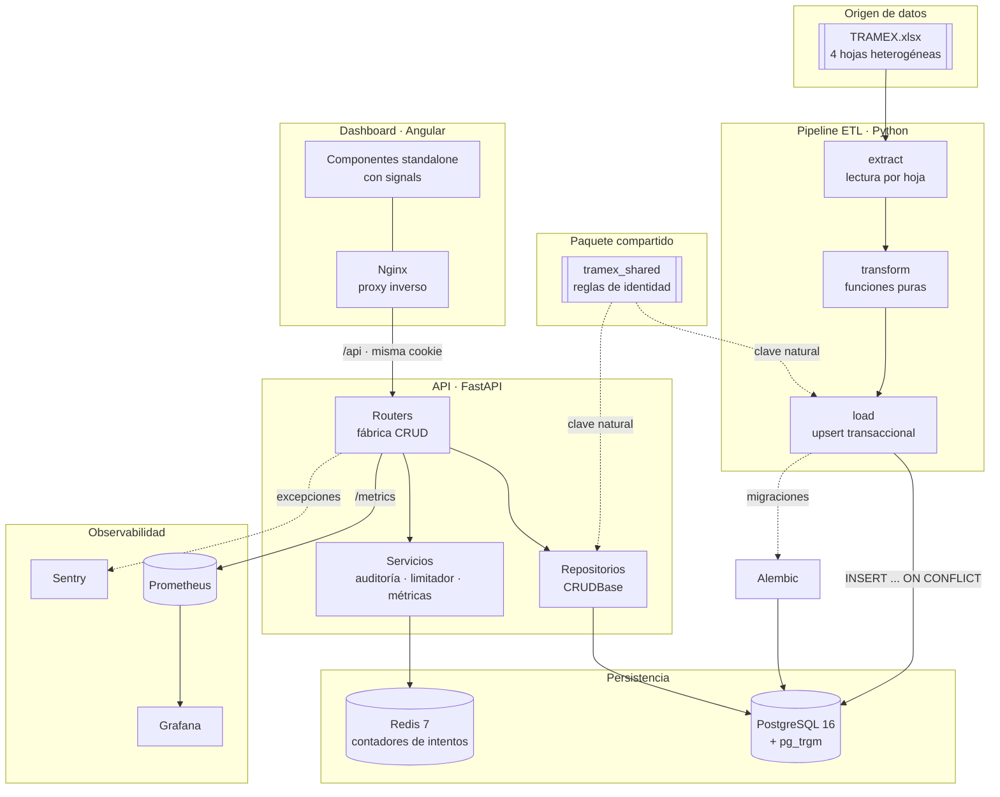

El **paquete compartido** es la pieza que evita el fallo silencioso más probable de
este diseño: el ETL y la API escriben en las mismas tablas, y si cada uno derivara la
identidad de una fila a su manera, un cliente dado de alta a mano y el mismo cliente
presente en el Excel acabarían duplicados sin que nada rompiera
([ADR 0006](docs/decisions/0006-paquete-compartido-entre-etl-y-api.md)).

---

## Modelo de datos

El Excel tenía cuatro pestañas planas sin ninguna relación. El modelo relacional gira
alrededor de `clientes`: una persona puede tener a la vez un trámite de pasaporte, uno
de Global Entry y uno de Canadá, y ahora eso es una consulta y no una búsqueda manual
por nombre en cuatro hojas.

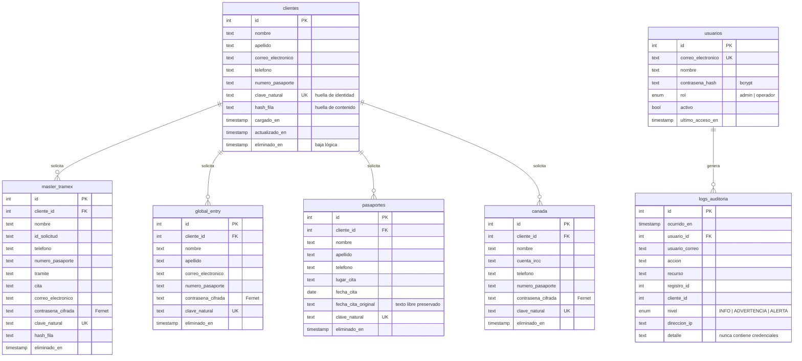

**`clave_natural` es única solo entre registros activos** (índice parcial). Así conviven
un registro vigente y sus versiones archivadas, y el `ON CONFLICT` del ETL puede apuntar
a ese índice ([ADR 0004](docs/decisions/0004-borrado-logico-y-retencion.md)).

---

## Seguridad y datos sensibles

Es lo que define el proyecto: el sistema custodia contraseñas de cuentas
gubernamentales de terceros.

### Por qué las credenciales se cifran y no se hashean

La reacción instintiva ante «hay que guardar contraseñas» es hashearlas con bcrypt.
Aquí sería un error de categoría, porque hash y cifrado responden preguntas distintas:

|  | Hash (bcrypt) | Cifrado (Fernet) |
|---|---|---|
| Responde | «¿es esta la contraseña correcta?» | «¿cuál era la contraseña?» |
| Se usa para | **verificar** a quien entra | **custodiar** un secreto ajeno |
| En este sistema | contraseñas de las **operadoras** | credenciales de las **cuentas de los clientes** |

La agencia no necesita *verificar* la contraseña del cliente: necesita *recuperarla*
para teclearla en el portal consular. Un hash la haría inservible. Por eso conviven
los dos mecanismos, y no es una contradicción
([ADR 0001](docs/decisions/0001-cifrado-reversible-de-credenciales.md)).

Como el dato es recuperable, el control no puede ser criptográfico y tiene que ser de
acceso. De ahí todo lo demás:

- **Autenticación real.** Tabla de usuarios con hash bcrypt, no un par de variables de
  entorno compartidas por todo el equipo. Un usuario por persona es lo que hace que
  «¿quién consultó esa credencial?» tenga respuesta.
- **Sesión en cookie `httpOnly`.** Invisible para JavaScript: un XSS ya no basta para
  robar la sesión. Se acepta también `Authorization: Bearer` para Swagger y scripts.
- **Dos roles.** `operador` gestiona trámites y consulta credenciales; `admin` además
  administra usuarios, lee la bitácora y ejecuta la retención.
- **Bitácora de auditoría.** Cada descifrado deja asiento con usuario, fecha, IP y
  registro. La respuesta del endpoint devuelve el número de asiento, y la interfaz lo
  muestra: quien consulta ve que ha quedado registrado. **Se registra qué se consultó,
  nunca qué se obtuvo.**
- **Fuerza bruta.** Bloqueo por cuenta (resiste rotación de IP) más límite por origen,
  con contadores en Redis para que varias réplicas compartan estado.
- **Comparación en tiempo constante** y hash señuelo cuando el correo no existe, para
  que el tiempo de respuesta no permita enumerar cuentas válidas.
- **Borrado lógico** reversible y auditado; la destrucción solo ocurre al aplicar la
  política de retención, que exige confirmación explícita.

> **La llave Fernet es el activo crítico.** Quien tenga `TRAMEX_FERNET_KEY` y un volcado
> de la base tiene todas las credenciales. En producción debe vivir en un gestor de
> secretos, nunca junto al respaldo.

---

## Estructura del repositorio

```text
tramex-etl/
├── docker-compose.yml          → Stack de desarrollo completo
├── docker-compose.prod.yml     → Stack de producción (imágenes de GHCR)
├── prometheus.yml              → Configuración de raspado de métricas
├── Makefile                    → Las mismas órdenes que ejecuta la CI
├── pyproject.toml              → Configuración de ruff, mypy, pytest y cobertura
│
├── shared/tramex_shared/       → PAQUETE COMPARTIDO
│   ├── identidad.py            → Normalización y cálculo de las huellas
│   └── esquema.py              → Definición declarativa de las entidades
│
├── etl/                        → PIPELINE (Python)
│   ├── etl_tramex.py           → Orquestación y CLI (argparse)
│   ├── helpers/
│   │   ├── limpieza.py         → Funciones puras sobre celdas
│   │   ├── extract.py          → Lectura de hojas y validación de estructura
│   │   ├── transform.py        → DataFrame → registros, sin efectos
│   │   ├── load.py             → Upsert transaccional e idempotente
│   │   └── config.py           → Entorno, cifrador y conexión
│   └── tests/                  → 88 pruebas
│
├── backend/                    → API (FastAPI)
│   ├── alembic/versions/       → 3 migraciones versionadas y reversibles
│   ├── app/
│   │   ├── models.py           → ORM: RegistroBase, clientes, trámites, usuarios
│   │   ├── schemas.py          → Contratos Pydantic v2
│   │   ├── config.py           → Configuración fail-fast
│   │   ├── security.py         → bcrypt, JWT, roles, dependencias
│   │   ├── crud/               → Repositorios (base genérica + cliente + trámites)
│   │   ├── routers/            → Fábrica CRUD, auth, clientes, administración
│   │   └── services/           → Auditoría, limitador, métricas
│   ├── scripts/                → Siembra del administrador inicial
│   └── tests/                  → 96 pruebas
│
├── frontend/                   → DASHBOARD (Angular 18)
│   └── src/app/
│       ├── models/             → Contratos de la API y configuración de recursos
│       ├── core/               → Servicios de sesión y HTTP, interceptor, guards
│       ├── features/           → login · dashboard · trámites · auditoría
│       └── shared/             → Diálogo de confirmación y formateadores
│
├── grafana/                    → Fuente de datos y panel aprovisionados
├── docs/
│   ├── decisions/              → Architecture Decision Records
│   ├── images/                 → Capturas de la interfaz
│   └── generar_datos_demo.py   → Generador de datos sintéticos
└── .github/
    ├── workflows/ci.yml        → Secretos, estilo, tipos, pruebas, integración
    ├── workflows/cd.yml        → Publicación en GHCR + escaneo de imágenes
    └── scripts/verificar_etl.py → Verificación end-to-end del pipeline
```

### Capas del backend

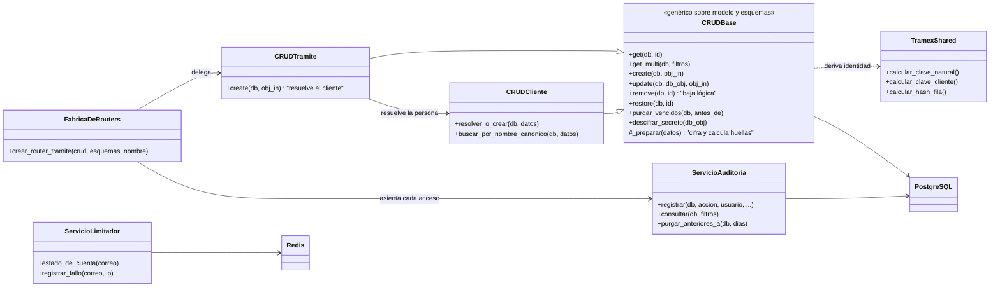

Los cuatro recursos de trámite **se generan desde una sola fábrica**. Antes eran cuatro
archivos con el mismo bloque de endpoints copiado, y el cifrado estaba repetido en tres
repositorios; cualquier cambio de contrato exigía tocar los cuatro y era cuestión de
tiempo que uno se quedara atrás.

---

## El pipeline ETL

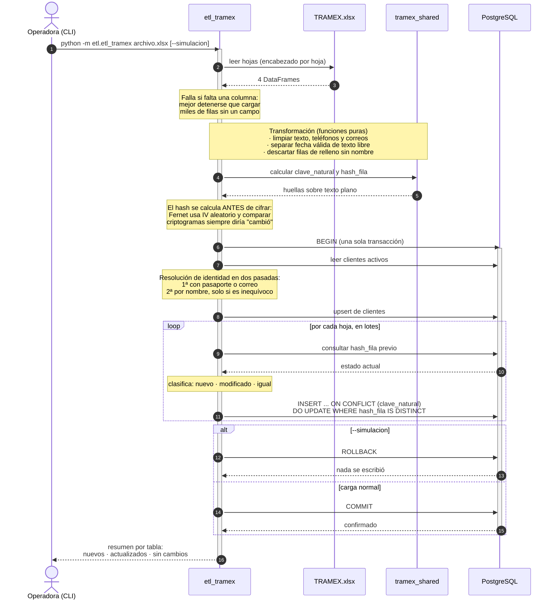

Ejemplo real de la segunda ejecución sobre el mismo archivo:

```text
==================================================================
 CARGA COMPLETADA
==================================================================
 tabla                 nuevos   actualizados    sin cambios
------------------------------------------------------------------
 clientes                   0              0              0
 master_tramex              0              0            140
 global_entry               0              0             56
 pasaportes                 0              0             77
 canada                     0              0             42
------------------------------------------------------------------
 Duracion: 0.117 s
 Sin novedades: el archivo ya estaba conciliado con la base.
==================================================================
```

---

## Cómo ejecutarlo

### Con Docker (recomendado)

```bash
# 1. Variables mínimas
cat > .env <<'EOF'
TRAMEX_FERNET_KEY=CxNCUQhBIDIRsETw8i-dfZBdmcnh6YX43VWS-9txMY4=
API_SECRET_KEY=clave-de-desarrollo-no-usar-en-produccion
ADMIN_INICIAL_CORREO=admin@tramex.dev
ADMIN_INICIAL_CONTRASENA=TramexAdmin2026!
EOF

# 2. Levantar todo (migra y siembra el administrador automáticamente)
docker compose up -d

# 3. Poblar con datos sintéticos para ver el sistema con contenido
python docs/generar_datos_demo.py raw-data/TRAMEX_demo.xlsx
make etl ARCHIVO=raw-data/TRAMEX_demo.xlsx
```

> La llave Fernet de arriba es de ejemplo y solo cifra datos de prueba. Genera la tuya
> con `python etl/generate_key.py`.

### Servicios y credenciales

| Servicio | URL | Usuario | Contraseña |
|---|---|---|---|
| **Dashboard** | http://localhost:4200 | `admin@tramex.dev` | `TramexAdmin2026!` |
| **API** | http://localhost:8000 | — | — |
| **Swagger** | http://localhost:8000/docs | mismas del dashboard | mismas |
| **Métricas** | http://localhost:8000/metrics | — | — |
| **Grafana** | http://localhost:3001 | `admin` | `admin` |
| **Prometheus** | http://localhost:9090 | — | — |
| **pgAdmin** | http://localhost:5051 | `admin@example.com` | `admin_password` |
| **PostgreSQL** | `localhost:5434` | `postgres` | `postgres_password` |
| **Redis** | `localhost:6379` | — | — |

> Son credenciales **de desarrollo**, fijadas para no tener que buscarlas. El stack de
> producción (`docker-compose.prod.yml`) no tiene valores por defecto: exige cada
> secreto por variable de entorno y se niega a arrancar sin ellos.

### En local, sin contenedores

```bash
make instalar                       # venv, dependencias, paquete compartido y hooks
docker compose up -d db redis       # solo la infraestructura
make migrar && make sembrar         # esquema y administrador inicial
make etl ARCHIVO=raw-data/TRAMEX_demo.xlsx

cd backend && .venv/bin/uvicorn app.main:app --reload   # API en :8000
cd frontend && npm start                                # dashboard en :4200
```

`make ayuda` lista todas las órdenes disponibles.

---

## La interfaz

| Inicio de sesión | Credenciales incorrectas |
| :---: | :---: |
| 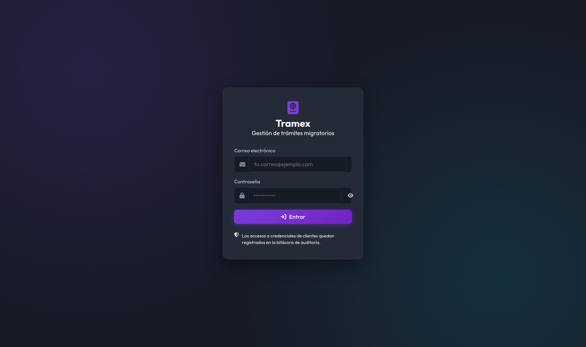 | 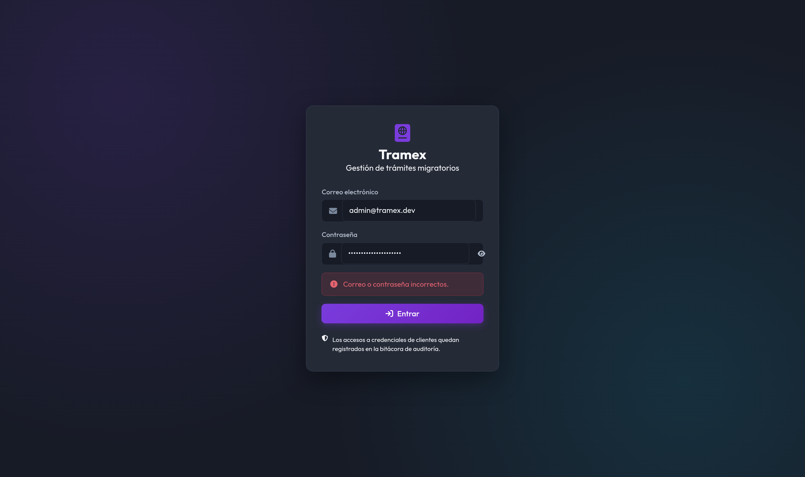 |

El mensaje no distingue «no existe» de «contraseña incorrecta», para no permitir
enumerar cuentas válidas; sí distingue en cambio una cuenta bloqueada por intentos
fallidos, porque si no la persona seguiría probando contraseñas sin entender qué pasa.

| Resumen del sistema | Listado con búsqueda y paginación |
| :---: | :---: |
| 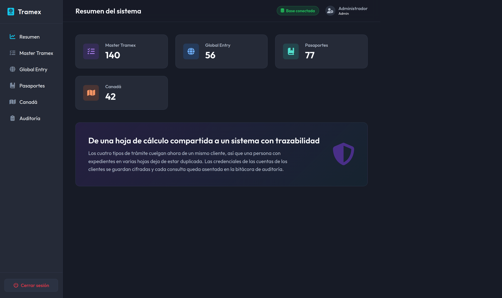 | 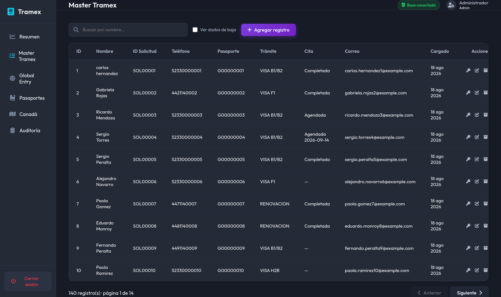 |

| Búsqueda por nombre | Alta y edición |
| :---: | :---: |
| 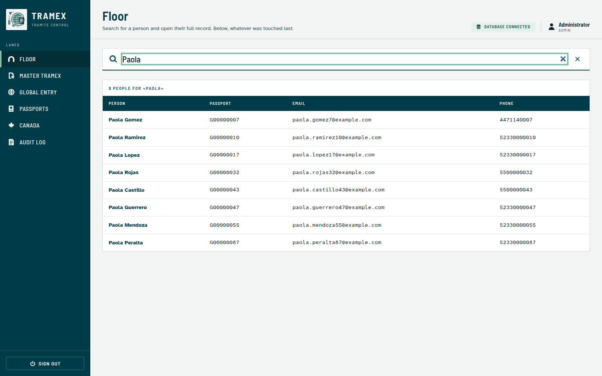 | 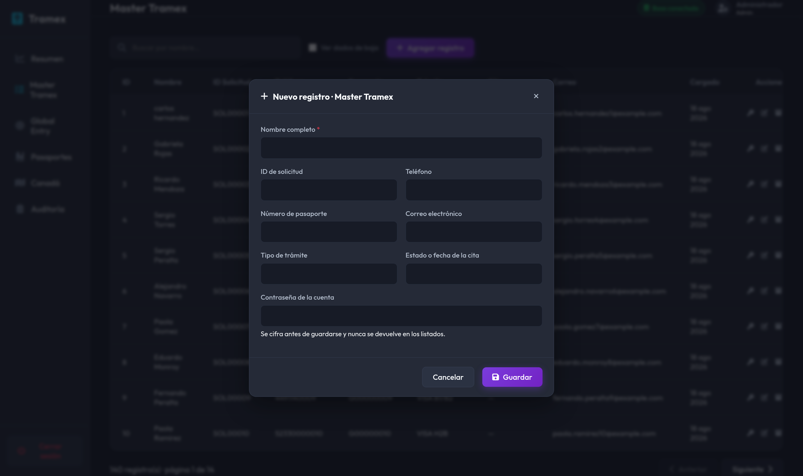 |

La búsqueda agrupa las pulsaciones en una sola petición y se apoya en un índice GIN de
trigramas, porque `ILIKE '%texto%'` no puede usar un índice B-tree. En el formulario,
**un campo de contraseña vacío significa «no la cambies»**, nunca «bórrala».

### Consulta de una credencial

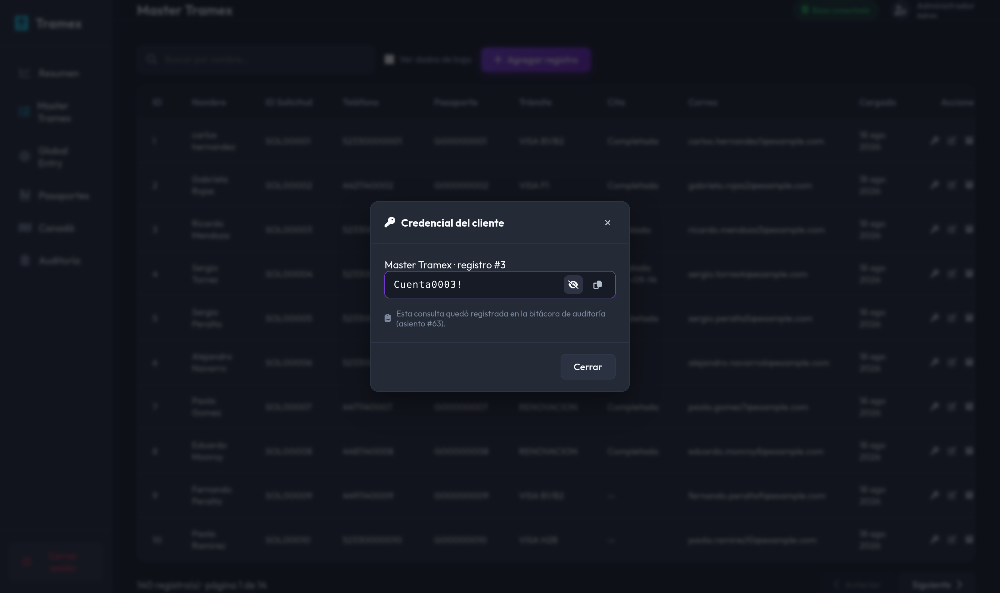

La operación más sensible del sistema. La credencial llega oculta, se revela solo bajo
petición explícita y el diálogo indica **el número de asiento que la consulta acaba de
dejar en la bitácora**: quien la hace ve que ha quedado registrada.

### Bitácora de auditoría

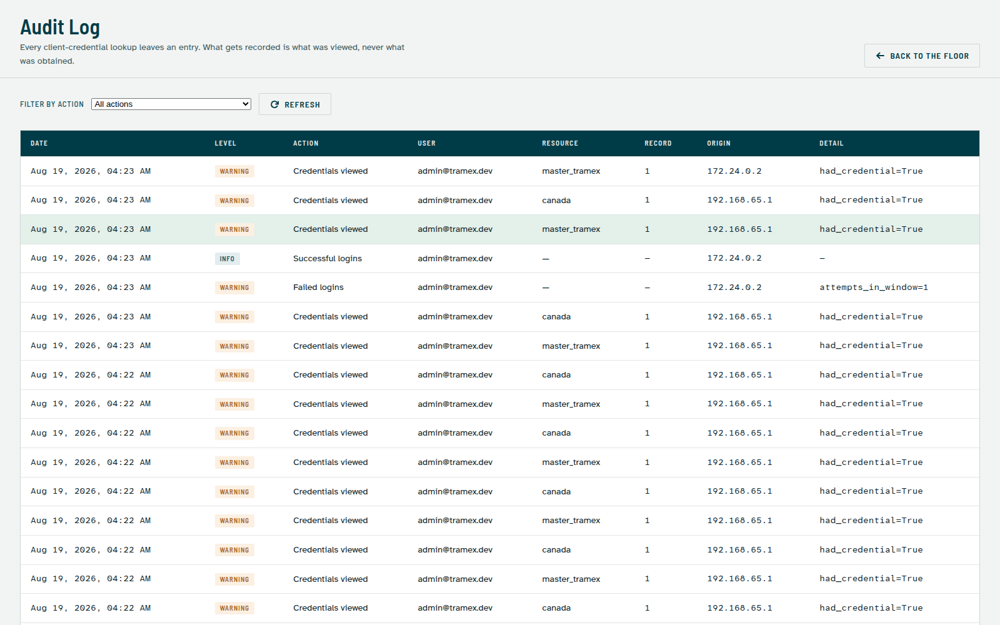

Accesible solo con rol `admin`. Registra logins exitosos, fallidos y bloqueados, altas,
modificaciones, bajas, restauraciones, purgas y cada descifrado de credencial, con su
nivel de severidad. Ningún asiento contiene contraseñas, tokens ni cookies.

### Fechas en texto libre

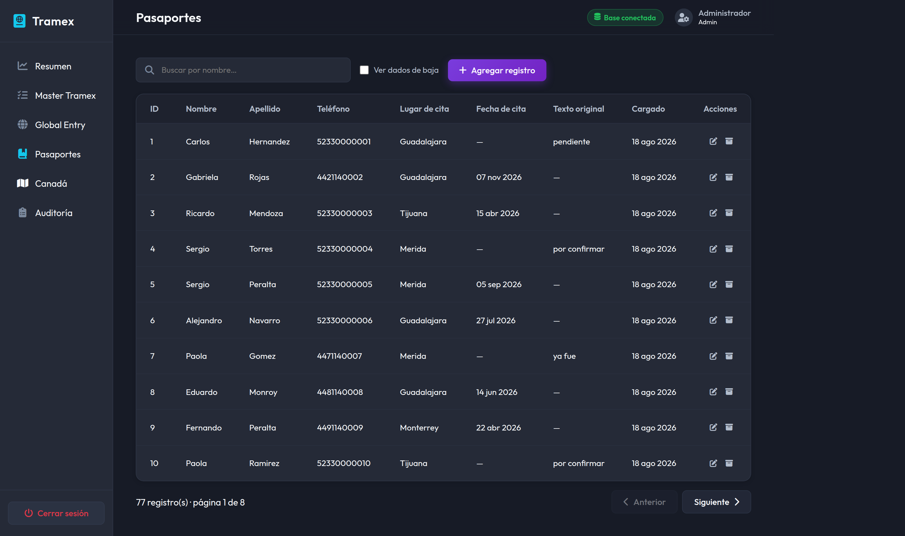

La hoja de origen mezcla fechas reales con texto escrito a mano (`"MARZO"`,
`"pendiente"`). El pipeline las preserva en `fecha_cita_original` en lugar de
descartarlas: es información que la operadora sí sabe interpretar.

---

## API

Documentación interactiva en `/docs`, generada desde el código:

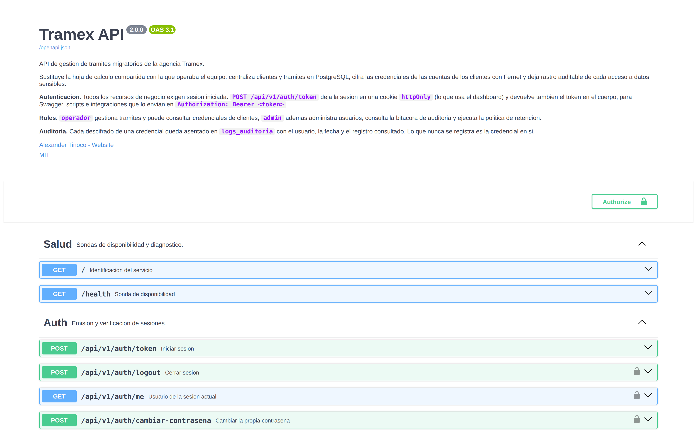

### Rutas principales

**Públicas**

| Método | Ruta | Descripción |
|---|---|---|
| `GET` | `/health` | Sonda de disponibilidad; verifica la base y devuelve 503 si no responde |
| `GET` | `/metrics` | Métricas en formato Prometheus |
| `POST` | `/api/v1/auth/token` | Inicia sesión; deja la cookie `httpOnly` y devuelve el token |

**Sesión iniciada (cualquier rol)**

| Método | Ruta | Descripción |
|---|---|---|
| `GET` | `/api/v1/auth/me` | Usuario de la sesión actual |
| `POST` | `/api/v1/auth/logout` | Cierra la sesión |
| `POST` | `/api/v1/auth/cambiar-contrasena` | Exige la contraseña vigente |
| `GET` | `/api/v1/clientes/` | Listado paginado de personas |
| `GET` | `/api/v1/clientes/{id}` | Cliente con el conteo de sus trámites por tipo |
| `GET` `POST` | `/api/v1/{recurso}/` | Listar (con `buscar`, `cliente_id`, `incluir_eliminados`) y crear |
| `GET` `PATCH` `DELETE` | `/api/v1/{recurso}/{id}` | Obtener, actualizar parcialmente y dar de baja |
| `POST` | `/api/v1/{recurso}/{id}/restaurar` | Reactivar un registro dado de baja |
| `GET` | `/api/v1/{recurso}/{id}/password` | **Descifra la credencial. Queda auditado.** |

Donde `{recurso}` es `master-tramex`, `global-entry`, `pasaportes` o `canada`.
`pasaportes` no expone `/password` porque no custodia credenciales.

**Rol `admin`**

| Método | Ruta | Descripción |
|---|---|---|
| `GET` `POST` | `/api/v1/admin/usuarios` | Listar y dar de alta usuarios |
| `PATCH` `DELETE` | `/api/v1/admin/usuarios/{id}` | Actualizar y dar de baja |
| `GET` | `/api/v1/admin/auditoria` | Bitácora, filtrable por acción, usuario, nivel y fecha |
| `POST` | `/api/v1/admin/retencion/ejecutar` | Purga definitiva; exige `confirmar=true` |

El sistema impide degradar o dar de baja al último administrador activo: recuperarse de
eso exigiría editar la base a mano.

---

## Observabilidad

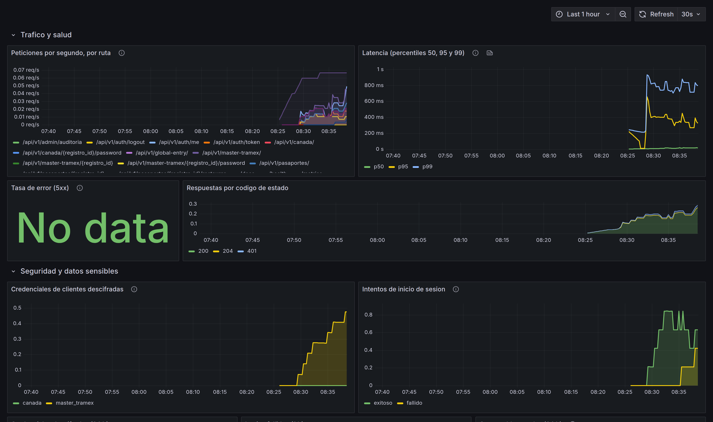

Grafana viene aprovisionado con el panel y la fuente de datos. Además del tráfico, la
latencia por percentiles y la tasa de error, mide lo que importa en este dominio:
**credenciales de clientes descifradas** e **intentos de inicio de sesión por
resultado**. La bitácora guarda el detalle asiento por asiento; la serie temporal
permite ver la tendencia y alertar si el volumen se dispara.

La etiqueta de ruta usa la plantilla (`/api/v1/canada/{registro_id}`) y no la URL
concreta: si no, cada registro generaría su propia serie y tumbaría el Prometheus por
cardinalidad. Hay una prueba que verifica que las métricas no contienen nombres de
clientes ni credenciales.

El backend emite además **logs estructurados en JSON** y reporta excepciones a
**Sentry** si se configura `SENTRY_DSN`.

---

## Variables de entorno

### API (`backend/.env`)

| Variable | Descripción | Por defecto |
|---|---|---|
| `APP_ENV` | `development`, `staging` o `production` | `development` |
| `DATABASE_URL` | Conexión a PostgreSQL | `postgresql+psycopg2://…@localhost:5434/tramex` |
| `TRAMEX_FERNET_KEY` | **Llave de cifrado de credenciales.** Sin ella la API no arranca | *(obligatoria)* |
| `API_SECRET_KEY` | Firma de los JWT de sesión | `dev-secret-change-in-production` |
| `TOKEN_EXPIRA_MINUTOS` | Duración de la sesión | `480` |
| `COOKIE_SECURE` / `COOKIE_SAMESITE` | Política de la cookie de sesión | `false` / `lax` |
| `BCRYPT_RONDAS` | Coste del hash de contraseñas | `12` |
| `ALLOWED_ORIGINS` | Orígenes CORS, separados por comas | `http://localhost:4200,…:8080` |
| `INTENTOS_MAXIMOS_LOGIN` / `VENTANA_BLOQUEO_MINUTOS` | Umbral y ventana de bloqueo | `5` / `15` |
| `REDIS_URL` | Contadores compartidos entre réplicas | *(sin valor)* |
| `DIAS_RETENCION` | Días antes de poder purgar lo archivado | `365` |
| `ADMIN_INICIAL_CORREO` / `ADMIN_INICIAL_CONTRASENA` | Siembra del primer administrador | `admin@example.com` / *(generada)* |
| `SENTRY_DSN` / `SENTRY_TRACES_SAMPLE_RATE` | Reporte de excepciones | *(vacío)* / `0.1` |
| `LOG_LEVEL` | Nivel del logger | `INFO` |

**En `production` la aplicación se niega a arrancar** si `ALLOWED_ORIGINS` contiene `*`,
si `API_SECRET_KEY` conserva el valor de ejemplo, si la base es SQLite, si la cookie no
es `Secure`, si falta Redis o si el coste de bcrypt baja de 12. Es preferible que el
despliegue falle de forma visible a que quede corriendo un servicio inseguro.

### ETL (`etl/.env`)

| Variable | Descripción |
|---|---|
| `DATABASE_URL` | Obligatoria. **No hay respaldo silencioso a SQLite**: creer que se cargó la base real cuando se escribió un archivo local es un fallo caro y difícil de notar |
| `TRAMEX_FERNET_KEY` | Debe ser **la misma** que usa la API, o esta no podrá descifrar lo que cargue el ETL |

### Dashboard

`API_PROXY_TARGET` define a dónde reenvía el servidor de desarrollo (`http://backend:8000`
dentro de Docker). En producción no hace falta: Nginx sirve el dashboard y hace de proxy
bajo el mismo origen, de modo que no hay dominio que configurar ni CORS que negociar.

---

## Calidad y gobernanza

### Integración continua

Cada push y cada pull request ejecutan:

1. **Escaneo de secretos** (Gitleaks) sobre el historial completo: un secreto filtrado
   sigue estándolo aunque después se borre del archivo.
2. **Estilo y tipos**: `ruff check`, `ruff format --check` y `mypy` en Python; ESLint y
   `tsc` en el frontend.
3. **Pruebas con umbral de cobertura** que rompe la ejecución si baja de 85 %.
4. **Integración contra PostgreSQL real**, que cubre lo que SQLite no puede:
   - las migraciones se aplican **y se revierten**;
   - **no hay deriva** entre los modelos y las migraciones (`alembic autogenerate` no
     debe detectar nada pendiente);
   - el ETL es idempotente de verdad, verificado con un Excel sintético que reproduce
     las rarezas del archivo real.
5. **Compilación de ambas imágenes Docker**, para detectar un Dockerfile roto antes de
   intentar entregar.

La detección de deriva encontró dos inconsistencias reales nada más escribirse, y las
dos se corrigieron.

### Entrega continua

Solo con una etiqueta `v*` o una release publicada, nunca en cada push a `main`:
publicar `latest` en cada commit hace imposible saber qué corre en producción. Publica
en GHCR con etiquetas semánticas, procedencia y SBOM, y escanea las imágenes con Trivy
subiendo el resultado al panel de seguridad.

### En local

```bash
make verificar      # exactamente lo que exige la CI
make lint           # ruff + ESLint
make tipos          # mypy + tsc
make cobertura      # pytest con el umbral del proyecto
make test           # backend + ETL + frontend
```

Los hooks de Husky validan el mensaje de cada commit (*Conventional Commits*) y pasan
los linters sobre los archivos preparados.

### Pruebas

| Suite | Cantidad | Qué cubre |
|---|---|---|
| **Backend** (pytest) | 96 | CRUD parametrizado sobre los cuatro recursos, resolución de identidad, autenticación real (sin *mocks*), roles, auditoría, fuerza bruta, retención, métricas y cabeceras |
| **ETL** (pytest) | 88 | Limpieza de celdas sucias, transformaciones, **idempotencia**, transaccionalidad, simulación y estructura del archivo |
| **Dashboard** (Karma + Jasmine) | 61 | Servicios, interceptor, guards, login, tabla y formulario |

Algunas pruebas comprueban propiedades concretas del sistema más que su código: que el
token **no** acaba en `localStorage`, que un campo de contraseña vacío no borra la
credencial del cliente, que un fallo a mitad de carga no deja datos parciales, que dos
homónimos sin identificador no se fusionan y que las métricas no filtran datos
personales.

---

## Decisiones de arquitectura

Las decisiones de fondo están documentadas en [`docs/decisions/`](docs/decisions/), con
su contexto, sus consecuencias y las alternativas descartadas:

| # | Decisión |
|---|---|
| [0001](docs/decisions/0001-cifrado-reversible-de-credenciales.md) | Cifrado reversible y no hash para las credenciales de clientes |
| [0002](docs/decisions/0002-identidad-reproducible-y-carga-idempotente.md) | Identidad reproducible de filas y carga idempotente |
| [0003](docs/decisions/0003-resolucion-de-identidad-en-dos-pasadas.md) | Resolución de identidad de personas en dos pasadas |
| [0004](docs/decisions/0004-borrado-logico-y-retencion.md) | Borrado lógico, unicidad parcial y política de retención |
| [0005](docs/decisions/0005-autenticacion-roles-y-auditoria.md) | Autenticación con sesión en cookie, roles y bitácora |
| [0006](docs/decisions/0006-paquete-compartido-entre-etl-y-api.md) | Un paquete compartido entre el ETL y la API |

---

## Limitaciones conocidas

Lo que el sistema **no** hace hoy, dicho explícitamente:

- **Rotar la llave Fernet exige re-cifrar la base.** No basta con cambiar la variable;
  falta automatizar el proceso.
- **Las personas sin pasaporte ni correo pueden fragmentarse** en varios clientes. Es
  deliberado —ante homónimos ambiguos se prefiere separar a fusionar por error— pero
  falta una herramienta de fusión asistida desde la interfaz.
- **La purga por retención es manual.** Lo natural es un job programado.
- **No hay MFA**, ni rotación automática de secretos, ni recuperación de contraseña por
  correo. Son necesarios si el sistema se expone a internet abierto; hoy está pensado
  para la red de la agencia detrás de HTTPS.
- **Sin despliegue público.** El stack de producción está definido y las imágenes se
  publican en GHCR, pero no hay entorno alojado.

---

## Licencia

[MIT](LICENSE) · Alexander Tinoco

Los datos reales de la agencia nunca forman parte de este repositorio. Todo lo que
aparece en capturas, pruebas y ejemplos es sintético y se genera con
[`docs/generar_datos_demo.py`](docs/generar_datos_demo.py).
