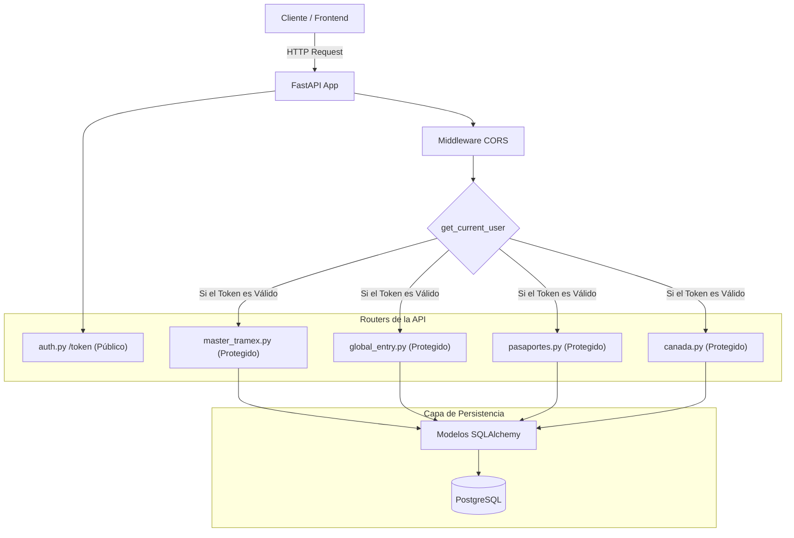
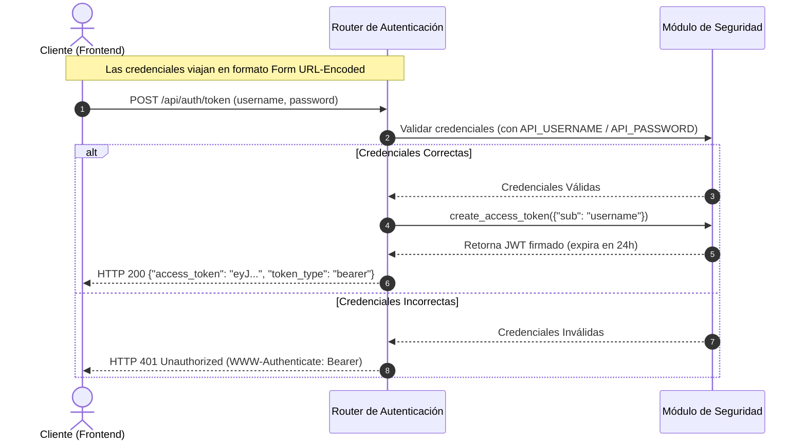
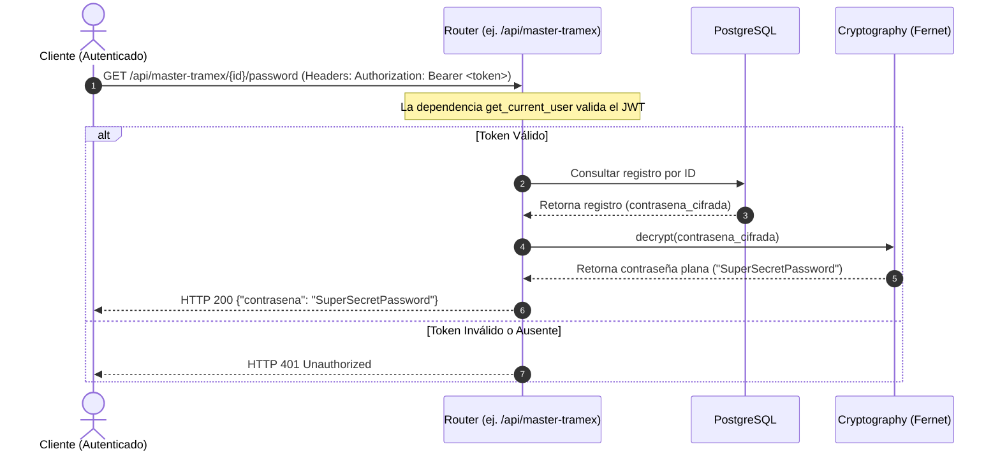

# Diagramas del Backend - Tramex API

Esta guía gráfica explica el funcionamiento interno del backend desarrollado con FastAPI, cubriendo la arquitectura, autenticación y seguridad de datos.

---

## 1. Arquitectura del Backend
Este diagrama muestra cómo viajan las solicitudes HTTP del cliente, cruzando los middlewares de CORS, validando el token de seguridad y enrutándose a los modelos ORM y la base de datos PostgreSQL.

---

## 2. Flujo de Autenticación JWT (Secuencia)
Describe el proceso que sigue el cliente para iniciar sesión con su nombre de usuario y contraseña (definidos en variables de entorno) y obtener un token JWT firmado de corta duración.

---

## 3. Flujo de Descifrado Seguro de Contraseñas (Secuencia)
Para proteger las contraseñas, los listados tradicionales (`GET /`) nunca las exponen. Este diagrama de secuencia detalla cómo funciona el endpoint específico para descifrar y retornar contraseñas únicamente a usuarios autenticados.

